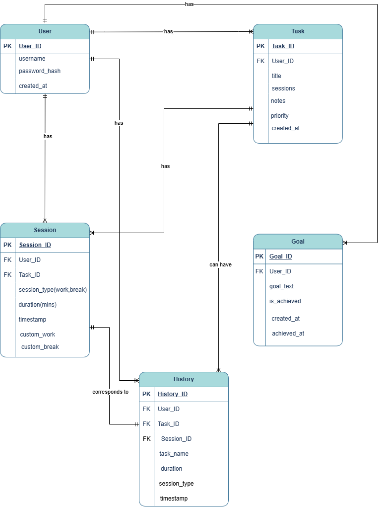

# ⏱️ Pomodoro – Task & Productivity Manager 🌸  

Pomodoro is a delightful task and time management web app designed using the **Pomodoro Technique**. Developed as part of a **Database Systems** course, it allows users to manage their focus time, break intervals, goals, and tasks—all while basking in a cozy pink pixel aesthetic. 🌙✨

---

## 📚 About the Project

This full-stack web application is built to demonstrate:

- 🌐 Real-world implementation of **relational databases** (normalized to 3NF)
- 🎨 Frontend + backend integration using **HTML, CSS, JS, PHP & MySQL**
- 👩‍💻 Hands-on experience in secure **authentication**, CRUD operations, and session tracking

Designed not just to fulfill academic requirements, but to create a tool that's actually fun and functional to use!

---

## ✨ Features

| Feature             | Description |
|---------------------|-------------|
| 👤 **User Auth**         | Secure login & signup with hashed passwords (bcrypt) |
| 📝 **Task Manager**      | Create, prioritize, update, and complete tasks |
| ⏲️ **Pomodoro Timer**    | 25-min work sessions + 5-min breaks (fully customizable) |
| 📜 **Session Logs**      | Sessions stored with type, duration & task linkage |
| 🎯 **Goal Tracking**     | Set personal goals and mark them as achieved |
| 🌸 **Pixel UI**          | Calming pink floral theme with pixel-art clouds and moon |
| 🌙 **Dark Mode**         | One click to switch your workspace vibe |
| 📊 **Progress Overview** | History & stats help visualize your focus habits |

---

## 🖼️ Screenshots

> 🌼 **Home (Light Mode)**  
> Login to your own cozy workspace!
> 

> 🌙 **Dark Mode**  
> Focus late into the night with our soothing moonlit palette.
> 

> 🍅 **Timer & Tasks View**  
> Everything you need in one view: your timer, your tasks, your vibe.
> 

---

## 🧠 ER Diagram

Visual representation of the Pomodoro+ database design:

---

## 🗃️ Database Schema Overview

**Database Name**: `pomodoro_task_manager`

### 🔐 users
| Column         | Type         | Notes             |
|----------------|--------------|-------------------|
| user_ID        | int (PK)     | Auto-increment    |
| username       | varchar      | Unique            |
| password_hash  | varchar      | Securely hashed   |
| created_at    | datetime     | Default: NOW()    |

### 📋 tasks
| Column         | Type         | Notes             |
|----------------|--------------|-------------------|
| task_ID        | int (PK)     | Auto-increment    |
| user_ID        | int (FK)     | Linked to users   |
| title          | varchar      | Task title        |
| priority       | enum         | Low, Medium, High |
| sessions | int     | Optional          |
| created_at    | datetime     | Default: NOW()    |
| notes | text | auto-increment |

### ⏱️ sessions
| Column         | Type         | Notes             |
|----------------|--------------|-------------------|
| session_ID     | int (PK)     | Auto-increment    |
| user_ID        | int (FK)     | Linked to users   |
| task_ID        | int (FK)     | Linked to tasks   |
| session_type   | enum         | work, break types |
| duration       | int          | In minutes        |
| date           | datetime     | Timestamp         |

### 📜 history
| Column         | Type         | Notes             |
|----------------|--------------|-------------------|
| id             | int (PK)     | Auto-increment    |
| user_ID        | int (FK)     | Linked to users   |
| task_ID        | int (FK)     | Linked to tasks   |
| session_type   | enum         | Same as sessions  |
| duration       | int          | Session time      |
| date           | datetime     | Logged at         |

### 🎯 goals
| Column         | Type         | Notes                  |
|----------------|--------------|------------------------|
| id             | int (PK)     | Auto-increment         |
| user_ID        | int (FK)     | Linked to users        |
| goal_text      | text         | Goal description       |
| status         | enum         | Active, Achieved       |
| created_date   | datetime     | Default: NOW()         |
| achieved_date  | datetime     | Nullable if unachieved |

---

## 🧱 Tech Stack

- **Frontend**: HTML, CSS (Pixel Theme), JavaScript
- **Backend**: PHP (Vanilla)
- **Database**: MySQL (Normalized to 3NF)
- **Authentication**: PHP sessions + hashed passwords
- **Hosting**: XAMPP / Localhost

---

## 🔍 How to Run Locally

# 1. Clone this repository
git clone https://github.com/your-username/pomodoro-manager.git

# 2. Move project into XAMPP's htdocs
mv pomodoro-manager C:/xampp/htdocs/

# 3. Start Apache & MySQL via XAMPP Control Panel

# 4. Import the SQL file into phpMyAdmin
#    Create database 'pomodoro_db', then import the .sql schema

# 5. Visit in browser
http://localhost/pomodoro-manager/
